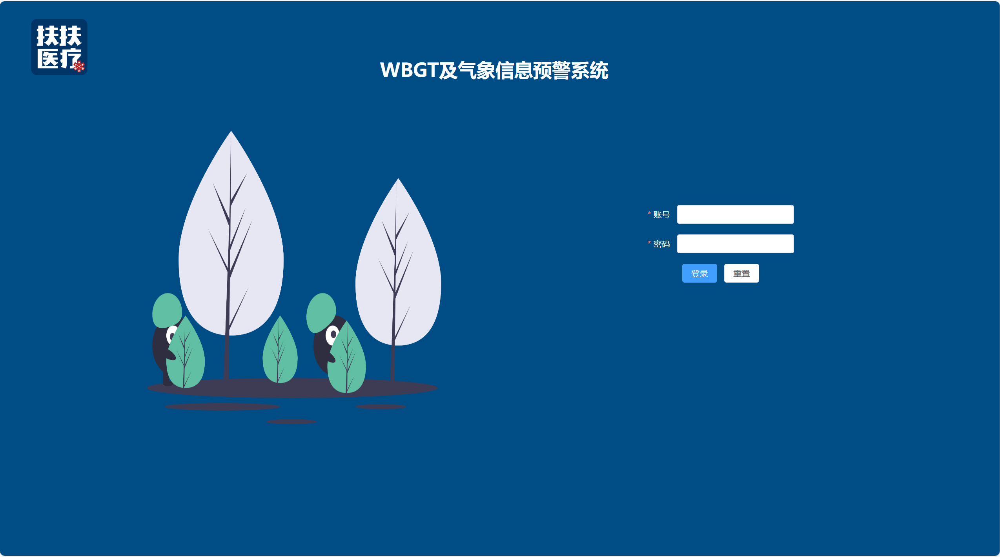

# WBGT_forward(DRF+Vue3)

# 一、项目前言

该项目是为WBGTOut赛事（马拉松）做的天气实时显示，包括实时的天气预警，还配合连接硬件来测试赛道的实时温度等诸多功能。

**感谢和风天气提供的相关天气API：**[https://dev.qweather.com/docs/api/warning/weather-warning/](https://dev.qweather.com/docs/api/warning/weather-warning/)

##### 1、项目源码地址

|        | 后端地址                                                     | 前端地址                                                     |
| ------ | ------------------------------------------------------------ | ------------------------------------------------------------ |
| github | [https://github.com/huangxiaoye6/WBGT_Backend](https://github.com/huangxiaoye6/WBGT_Backend) | [https://github.com/huangxiaoye6/WBGT_forward](https://github.com/huangxiaoye6/WBGT_forward) |

##### 2、项目功能

1、用户登录：使用Jwt实现用户信息传输和认证

2、天气实时显示：实时显示天气的温度，空气湿度，降水量等，也可通过搜索来显示其他地方天气信息。

3、空气质量实时显示：实时显示空气质量的空气指数，PM10，PM2.5，NO2，SO2等相关信息。

4、赛道数据实时显示：配合连接硬件实时显示赛道温度，赛道湿度，黑球温度，湿球温度等相关信息。

5、气象预警实时显示：实时显示气象预警分析的相关信息等。

##### 3、前端项目目录结构

```
├─public   # 用于存放静态资源
├─src  
│  ├─app.vue # Vue应用的根组件
│  ├─main.ts  # 项目的入口文件
│  ├─assets  # 用于存放静态资源
│  ├─components  # 封装的组件
│  ├─router # 路由目录
│  ├─store  # Vue的状态管理
│  ├─utils  # 工具目录
│  │	├──────request.js  # 封装axios请求文件
│  │
│  └─views  # 业务组件目录
│─static  # 用于存放静态资源
├── package.json        # 项目配置文件及依赖列表
├── package-lock.json    # npm生成的文件，用于锁定安装包的版本
├──tsconfig.json   # TypeScript配置文件  
├──vue.config.js   # Vue CLI的配置文件，用于覆盖默认配置
└─README.md  # 项目说明文件
```

# 二、项目配置到本地

#### 1、项目依赖配置

在当前项目的终端下执行

```
npm install
```

#### 2、项目运行

在当前项目的终端下执行

```
npm run dev
```

# 三、项目效果演示




# 四、问题

如果项目有问题请在[这里](https://github.com/huangxiaoye6/django-rest-framework-DRF---house-/issues)点击提交，当然也可以发送到我的邮箱[2194482868@qq.com](mailto:2194482868@qq.com),我将尽快为大家解答

# 致大家🙋‍♀️🙋‍♂️

如果本项目帮助到了你，请给项目加个[Star](https://github.com/huangxiaoye6/Vue3-house-/blob/main)，让更多的人看到。 您的回复和支持将会是我继续更新维护下去的动力。
